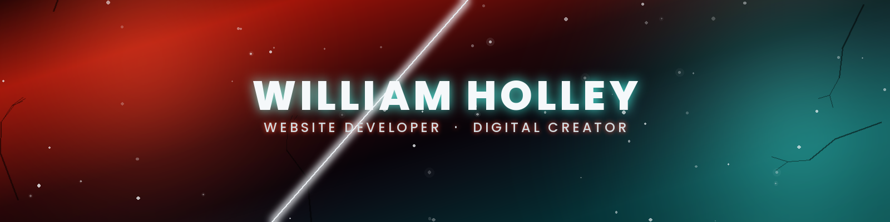
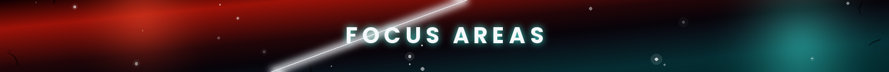
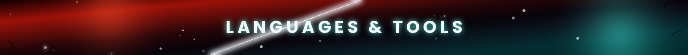
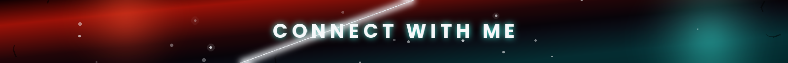

-  17-year-old full-stack web developer
-  Passionate about building modern web applications
-  Always learning new technologies and improving my skills
-  Interested in AI, open source, and software development
-  Open to collaboration and new opportunities

-  Full-Stack Development
-  Web Application Development
-  Open Source
-  Artificial Intelligence
-  UI/UX Design
-  Cloud Computing

**Languages**

&nbsp;&nbsp;&nbsp;
&nbsp;&nbsp;&nbsp;

**Frontend & Backend**

&nbsp;&nbsp;&nbsp;
&nbsp;&nbsp;&nbsp;

**Database**

&nbsp;&nbsp;&nbsp;

&nbsp;&nbsp;&nbsp;&nbsp;
&nbsp;&nbsp;&nbsp;&nbsp;

