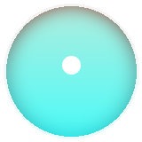
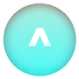

 

 

- :small_blue_diamond: 17-year-old full-stack web developer
- :small_blue_diamond: Passionate about building modern web applications
- :small_blue_diamond: Always learning new technologies and improving my skills
- :small_blue_diamond: Interested in AI, open source, and software development
- :small_blue_diamond: Open to collaboration and new opportunities

 

- :small_blue_diamond: Full-Stack Development
- :small_blue_diamond: Web Application Development
- :small_blue_diamond: Open Source
- :small_blue_diamond: Artificial Intelligence
- :small_blue_diamond: UI/UX Design
- :small_blue_diamond: Cloud Computing

 

 

 

  

<strong>Programming Languages</strong>  

&nbsp;&nbsp;&nbsp;&nbsp;
&nbsp;&nbsp;&nbsp;&nbsp;

  

<strong>Frontend</strong>  

  

<strong>Backend</strong>  

&nbsp;&nbsp;&nbsp;&nbsp;

  

<strong>Database</strong>  

&nbsp;&nbsp;&nbsp;&nbsp;

 

  

&nbsp;&nbsp;&nbsp;&nbsp;&nbsp;
&nbsp;&nbsp;&nbsp;&nbsp;&nbsp;

  

  

